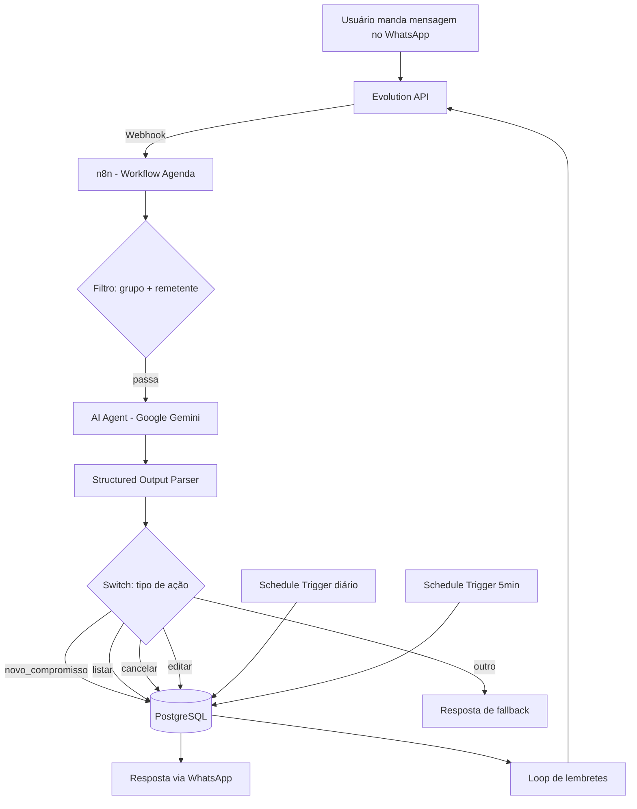

# 📅 Agenda via WhatsApp

Assistente pessoal de agenda que roda inteiramente pelo WhatsApp. Envie uma mensagem em linguagem natural, e a automação interpreta, organiza e lembra você dos seus compromissos — sem apps extras, sem fricção.

> Projeto pessoal construído para aplicar e demonstrar conhecimentos em automação low-code, integração de LLMs e infraestrutura containerizada.

---

## ✨ Funcionalidades

- **Criar compromissos** por linguagem natural: *"Agendar reunião com o cliente dia 15/07 às 14h"*
- **Listar compromissos pendentes** com um simples "listar"
- **Cancelar** um compromisso pelo número do ID
- **Editar** campos específicos (hora, data, título, categoria) sem afetar o resto
- **Lembrete diário automático** — resumo dos compromissos do dia, toda manhã
- **Aviso 30 minutos antes** de cada compromisso
- Interação isolada em um **grupo dedicado do WhatsApp**, sem interferir nas conversas pessoais

---

## 🏗️ Arquitetura



---

## 🛠️ Stack técnica

| Camada | Tecnologia |
|---|---|
| Automação / Orquestração | [n8n](https://n8n.io) (self-hosted, Docker) |
| Integração WhatsApp | [Evolution API v2](https://github.com/EvolutionAPI/evolution-api) (open-source, self-hosted) |
| IA / Extração de dados | Google Gemini (`gemini-3.1-flash-lite`) via API |
| Banco de dados | PostgreSQL 15 |
| Cache / Sessões | Redis |
| Infraestrutura | Docker & Docker Compose |

---

## 📐 Modelo de dados

```sql
CREATE TABLE compromissos (
    id SERIAL PRIMARY KEY,
    titulo VARCHAR(255) NOT NULL,
    data DATE NOT NULL,
    hora TIME,
    categoria VARCHAR(50) NOT NULL,
    remetente VARCHAR(50) NOT NULL,
    status VARCHAR(20) DEFAULT 'pendente',
    lembrete_enviado BOOLEAN DEFAULT false,
    aviso_30min_enviado BOOLEAN DEFAULT false,
    criado_em TIMESTAMP DEFAULT NOW()
);
```

---

## 🚀 Como rodar localmente

### Pré-requisitos
- Docker e Docker Compose instalados
- Uma chave de API do [Google AI Studio](https://aistudio.google.com) (gratuita)
- Um número de WhatsApp disponível para conectar (recomenda-se um número separado do pessoal)

### 1. Clone o repositório
```bash
git clone https://github.com/SEU-USUARIO/agenda-whatsapp.git
cd agenda-whatsapp
```

### 2. Configure as variáveis de ambiente
```bash
cp .env.example .env
```
Edite o `.env` com suas próprias credenciais (veja a seção abaixo).

### 3. Suba os containers
```bash
docker network create automacao-net
docker compose up -d
```

### 4. Conecte o WhatsApp
Acesse `http://localhost:8080/manager`, crie a instância e escaneie o QR Code.

### 5. Configure o webhook da instância
```bash
curl -X POST http://localhost:8080/webhook/set/agenda-bot \
  -H "Content-Type: application/json" \
  -H "apikey: SUA_CHAVE" \
  -d '{"webhook": {"enabled": true, "url": "http://n8n-container:5678/webhook/agenda", "events": ["MESSAGES_UPSERT"]}}'
```

### 6. Importe os workflows
No n8n (`http://localhost:5678`), importe os arquivos `.json` da pasta `/workflows` deste repositório.

---

## 🔐 Variáveis de ambiente

Veja `.env.example` para a lista completa. Nenhuma credencial real está commitada neste repositório.

---

## 🧩 Desafios técnicos e decisões de design

Alguns problemas reais enfrentados durante o desenvolvimento (documentados aqui porque fazem parte do aprendizado):

- **Migração de imagem Docker**: o repositório oficial da Evolution API mudou de `atendai/evolution-api` para `evoapicloud/evolution-api` — projeto depende de acompanhar mudanças upstream.
- **Volumes do Postgres são imutáveis na criação**: alterar credenciais no `.env` depois do primeiro `up` exige `docker compose down -v` para recriar o volume.
- **Tipos `TIME`/`DATE` do Postgres via driver do n8n**: vêm serializados como objetos de data completos (`1970-01-01T14:00:00`). Resolvido formatando direto na query com `TO_CHAR()`, evitando parsing manual em JavaScript.
- **SQL Injection**: todas as queries dinâmicas usam **Query Parameters** (`$1`, `$2`...) em vez de interpolação direta de string.
- **Structured Output Parser do n8n**: o modo "Generate from JSON Example" espera um *exemplo de dado*, não o schema — usar o schema ali faz o modelo devolver a própria estrutura ao invés dos valores. Corrigido usando o modo "Define using JSON Schema".
- **Modelos Gemini descontinuados**: `gemini-2.0-flash` e `gemini-2.5-flash` deixaram de estar disponíveis para chaves novas: migrado para `gemini-3.1-flash-lite`.
- **Contexto temporal para o LLM**: a data atual precisa ser injetada explicitamente no *prompt* enviado a cada chamada (não basta declarar no *system message*), para evitar que o modelo "invente" o ano ao calcular datas relativas.

---

## 📌 Roadmap / possíveis expansões

- [ ] Suporte a múltiplos usuários/grupos simultâneos
- [ ] Categorização automática por machine learning ao invés de enum fixo
- [ ] Dashboard web para visualização dos compromissos
- [ ] Testes automatizados dos workflows

---

## 👤 Autor

**[Seu Nome]** — Analista de Sistemas Jr. | Em transição para DevOps/Cloud
[LinkedIn](https://linkedin.com/in/SEU-LINK) · [GitHub](https://github.com/SEU-USUARIO)

---

## 📄 Licença

Este projeto está sob a licença MIT — sinta-se livre para usar como referência de aprendizado.
