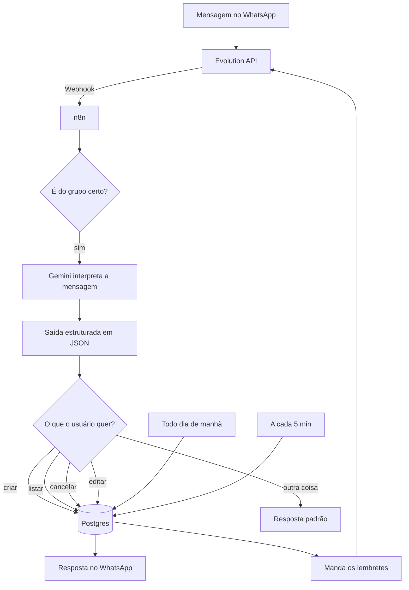

# 📅 Agenda via WhatsApp

Um assistente de agenda que funciona direto pelo WhatsApp: você manda uma mensagem tipo *"reunião com o cliente dia 15/07 às 14h"*, e o sistema entende, salva e te avisa depois. Sem app, sem cadastro, sem nada — só o WhatsApp que você já usa todo dia.

Comecei esse projeto pra sair um pouco do automação "só n8n" que já fazia no trabalho e aprender a integrar tudo isso com IA e infraestrutura de verdade: Docker, banco de dados, API não-oficial de WhatsApp, LLM. Ainda sou iniciante em boa parte disso (principalmente Docker e DevOps), então esse repositório também é um registro de como fui resolvendo os problemas que apareceram no caminho.

---

## O que ele faz

- Cria compromissos a partir de uma mensagem em português normal
- Lista os compromissos pendentes quando você manda "listar"
- Cancela um compromisso pelo número (ex: "cancelar 3")
- Edita campos específicos sem bagunçar o resto (ex: "editar 3 para 16h")
- Manda um resumo automático toda manhã
- Avisa 30 minutos antes de cada compromisso
- Só responde dentro de um grupo dedicado do WhatsApp, pra não misturar com conversas normais

---

## Como funciona por baixo dos panos



---

## Stack usada

| Parte | Ferramenta |
|---|---|
| Automação | [n8n](https://n8n.io), rodando em Docker |
| WhatsApp | [Evolution API v2](https://github.com/EvolutionAPI/evolution-api) (open-source) |
| IA | Google Gemini (`gemini-3.1-flash-lite`) |
| Banco | PostgreSQL |
| Cache | Redis |

Escolhi Evolution API em vez de uma API paga (tipo Z-API) porque é open-source e eu podia hospedar ela mesmo — dava pra praticar Docker de verdade em vez de só consumir um serviço pronto.

---

## Tabela do banco

```sql
CREATE TABLE compromissos (
    id SERIAL PRIMARY KEY,
    titulo VARCHAR(255) NOT NULL,
    data DATE NOT NULL,
    hora TIME,
    categoria VARCHAR(50) NOT NULL,
    remetente VARCHAR(50) NOT NULL,
    status VARCHAR(20) DEFAULT 'pendente',
    lembrete_enviado BOOLEAN DEFAULT false,
    aviso_30min_enviado BOOLEAN DEFAULT false,
    criado_em TIMESTAMP DEFAULT NOW()
);
```

---

## Rodando o projeto localmente

### Antes de começar, você vai precisar de:
- Docker e Docker Compose
- Uma chave de API gratuita do [Google AI Studio](https://aistudio.google.com)
- Um número de WhatsApp pra conectar (o ideal é usar um separado do seu principal)

### 1. Clona o repositório
```bash
git clone https://github.com/Edilsoonn/agenda-whatsapp.git
cd agenda-whatsapp
```

### 2. Configura as variáveis de ambiente
```bash
cp .env.example .env
```
Edita o `.env` com suas credenciais.

### 3. Sobe os containers
```bash
docker network create automacao-net
docker compose up -d
```

### 4. Conecta o WhatsApp
Acessa `http://localhost:8080/manager`, cria a instância e escaneia o QR Code.

### 5. Configura o webhook
```bash
curl -X POST http://localhost:8080/webhook/set/agenda-bot \
  -H "Content-Type: application/json" \
  -H "apikey: SUA_CHAVE" \
  -d '{"webhook": {"enabled": true, "url": "http://n8n-container:5678/webhook/agenda", "events": ["MESSAGES_UPSERT"]}}'
```

### 6. Importa os workflows
Dentro do n8n (`http://localhost:5678`), importa os arquivos `.json` que estão na pasta `/workflows`.

---

## Problemas que apareceram no caminho (e como resolvi)

Deixei essa seção porque acho mais útil documentar os erros reais do que fingir que tudo saiu certo de primeira. Se você é iniciante que nem eu, talvez esses pontos te poupem um tempo:

- **A imagem Docker da Evolution API mudou de nome** (de `atendai/evolution-api` pra `evoapicloud/evolution-api`) sem muito aviso — se seguir tutorial antigo, vai dar erro de "repository not found".
- **Trocar a senha do Postgres no `.env` depois que o container já subiu não funciona** — o Postgres só lê essas variáveis na primeira vez que cria o volume. Se precisar mudar, tem que rodar `docker compose down -v` (isso apaga os dados, cuidado).
- **O Postgres devolve hora e data de um jeito esquisito pro n8n** — tipo `1970-01-01T14:00:00` pra uma coluna que é só `TIME`. Resolvi formatando direto na query com `TO_CHAR()`, em vez de tentar consertar isso em JavaScript depois.
- **Interpolar valores direto dentro do SQL é perigoso** — comecei fazendo `WHERE id = {{ valor }}` direto na query, e troquei pra usar Query Parameters (`$1`, `$2`) depois de entender que isso abre brecha pra SQL Injection.
- **O parser de saída estruturada do n8n tem dois modos parecidos, mas bem diferentes** — um espera um exemplo de dado, o outro espera o schema de verdade. Usei o errado no começo e o modelo ficava devolvendo a própria estrutura do schema em vez dos dados reais.
- **Os modelos do Gemini vão sendo descontinuados com o tempo** — comecei com `gemini-2.0-flash`, parou de funcionar, tentei `gemini-2.5-flash`, também não estava mais disponível pra chave nova, e fechei com `gemini-3.1-flash-lite`.
- **A IA não sabe que dia é hoje sozinha** — pra ela calcular "amanhã" ou "sexta-feira" certo, preciso mandar a data atual junto de cada mensagem que envio pra ela, não adianta só falar isso no prompt de sistema uma vez.

---

## O que pretendo melhorar

- [ ] Deixar funcionando pra mais de um grupo/usuário ao mesmo tempo
- [ ] Painel web simples pra ver os compromissos sem precisar mandar "listar"
- [ ] Escrever alguns testes automatizados (ainda não sei direito como fazer isso pra workflows do n8n)

---

## Sobre mim

Feito por **Edilson Junior**, Analista de Sistemas Jr. em transição pra DevOps/Cloud.

Se esse projeto te ajudou de alguma forma ou você quer trocar uma ideia sobre automação, n8n ou infra, me chama:

[LinkedIn](https://www.linkedin.com/in/edilson-antonio) · [GitHub](https://github.com/Edilsoonn)

---

## Licença

MIT — usa como quiser, inclusive como referência de estudo.
